### Technologie sieciowe, lista 2

#### Grupa: czwartek 17:05

#### Autor: Joanna Kulig

#### Nr indeksu: 261738

##

#### 1. Opis zadania:

W zadaniu należało stworzyć model sieci, czyli:

- jego topologię, przy założeniach $|V| = 20$ oraz $|E| < 30$, nie ma odizolowanych wierzchołków
- zaproponować macierz natężeń strumienia pakietów $N$
- określić funkcje przepustowości krawędzi $c$ oraz przepływu $a$, aby dla każdej krawędzi $e$ zachodził warunek $c(e) > a(e)$

Dla tak zdefiniowanej sieci należalo stworzyć program, który szacował niezawodność takiej sieci, a także jak się ona zmienia:

- przy ustalonej struturze topologicznej i przepustowościach oraz zwiększających się wartościach w macierzy natężeń
- przy ustalonej struturze topologicznej i macierzy natężeń oraz zwiększających się przepustowościach
- przy ustalonej struturze topologicznej i macierzy natężeń, gdy dodajemy nowe krawędzie

Do realizacji zadania wybrałam język **Julia**, a do stworzenia i modyfikowania grafu wykorzystałam bibliotekę **Graphs**. Ponadto do jego poprawnego wyświetlenia, potrzebne były biblioteki **GraphPlot**, **Cairo** oraz **Fontconfig**.

#### 2. Model sieci

##### 2.1 Topologia grafu

Zaproponowana przeze mnie topologia ma $|V| = 20$ oraz $|E| = 29$. Posiada dwa mniejsze grafy cykliczne o $6$ i $14$ węzłach.
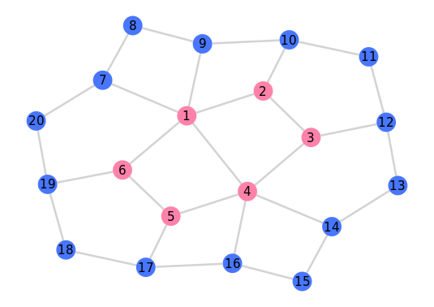.

##### 2.2 Macierz natężeń

Do wykonywania testów stworzyłam macierz natężeń $N = [n_i,_j]$, gdzie element $n_i,_j$ jest liczbą pakietów przesyłanych (wprowadzanych do sieci) w ciągu sekundy od źródła $v_i$ do ujścia $v_j$. Jest to macierz symetryczna, tzn. $n_i,_j = n_j,_i$, przy założeniu, że $n_i,_i = 0$.
Przykładowo wygenerowana macierz:

$
\begin{bmatrix}
0 & 35 & 17 & 31 & 13 & 23 & 39 & 38 & 13 & 28 & 5 & 20 & 15 & 33 & 13 & 19 & 33 & 2 & 6 & 18\\35 & 0 & 37 & 8 & 11 & 1 & 11 & 3 & 34 & 31 & 2 & 12 & 6 & 21 & 17 & 31 & 27 & 14 & 26 & 10\\17 & 37 & 0 & 19 & 26 & 32 & 33 & 20 & 27 & 14 & 25 & 35 & 1 & 5 & 24 & 22 & 37 & 30 & 25 & 36\\31 & 8 & 19 & 0 & 12 & 5 & 26 & 20 & 39 & 33 & 34 & 6 & 28 & 27 & 19 & 7 & 6 & 11 & 27 & 18\\13 & 11 & 26 & 12 & 0 & 21 & 28 & 14 & 13 & 6 & 16 & 13 & 22 & 22 & 16 & 7 & 25 & 34 & 18 & 38\\23 & 1 & 32 & 5 & 21 & 0 & 20 & 16 & 33 & 15 & 34 & 14 & 9 & 14 & 32 & 28 & 36 & 35 & 22 & 1\\39 & 11 & 33 & 26 & 28 & 20 & 0 & 25 & 31 & 7 & 13 & 7 & 7 & 8 & 13 & 18 & 10 & 18 & 29 & 34\\38 & 3 & 20 & 20 & 14 & 16 & 25 & 0 & 33 & 24 & 25 & 15 & 11 & 13 & 22 & 5 & 8 & 20 & 26 & 17\\13 & 34 & 27 & 39 & 13 & 33 & 31 & 33 & 0 & 6 & 21 & 18 & 29 & 28 & 15 & 23 & 12 & 21 & 2 & 38\\28 & 31 & 14 & 33 & 6 & 15 & 7 & 24 & 6 & 0 & 25 & 19 & 26 & 21 & 20 & 38 & 36 & 17 & 28 & 25\\5 & 2 & 25 & 34 & 16 & 34 & 13 & 25 & 21 & 25 & 0 & 17 & 19 & 2 & 7 & 14 & 35 & 28 & 33 & 30\\20 & 12 & 35 & 6 & 13 & 14 & 7 & 15 & 18 & 19 & 17 & 0 & 5 & 20 & 37 & 9 & 29 & 21 & 28 & 16\\15 & 6 & 1 & 28 & 22 & 9 & 7 & 11 & 29 & 26 & 19 & 5 & 0 & 12 & 11 & 31 & 9 & 12 & 5 & 36\\33 & 21 & 5 & 27 & 22 & 14 & 8 & 13 & 28 & 21 & 2 & 20 & 12 & 0 & 20 & 20 & 2 & 35 & 24 & 24\\13 & 17 & 24 & 19 & 16 & 32 & 13 & 22 & 15 & 20 & 7 & 37 & 11 & 20 & 0 & 32 & 3 & 6 & 21 & 35\\19 & 31 & 22 & 7 & 7 & 28 & 18 & 5 & 23 & 38 & 14 & 9 & 31 & 20 & 32 & 0 & 15 & 18 & 11 & 1\\33 & 27 & 37 & 6 & 25 & 36 & 10 & 8 & 12 & 36 & 35 & 29 & 9 & 2 & 3 & 15 & 0 & 14 & 23 & 7\\2 & 14 & 30 & 11 & 34 & 35 & 18 & 20 & 21 & 17 & 28 & 21 & 12 & 35 & 6 & 18 & 14 & 0 & 16 & 24\\6 & 26 & 25 & 27 & 18 & 22 & 29 & 26 & 2 & 28 & 33 & 28 & 5 & 24 & 21 & 11 & 23 & 16 & 0 & 30\\18 & 10 & 36 & 18 & 38 & 1 & 34 & 17 & 38 & 25 & 30 & 16 & 36 & 24 & 35 & 1 & 7 & 24 & 30 & 0
\end{bmatrix}
$

##### 2.3 Funkcja przepływu

Funkcja przepływu zadana jest wzorem:

$a(e)=Σ_{i=1}^{|V|}$ $Σ_{j=1}^{|V|}$ $[|e$ $ϵ$ $P(i,j)|]$ $n_i,_j$

gdzie:

- $P(i,j)$ to zbiór wszystkich krawędzi wybranej ścieżki z wierzchołka $v_i$ do $v_j$, w moim programie jest to najkrótsza możliwa ścieżka między tymi wierzchołkami
- $[|e$ $ϵ$ $A|]$ oznacza indykator zbioru $A$, tj. $1$ tam, gdzie $e$ $ϵ$ $A$, a $0$ w przeciwnym przypadku.

#### 2.4 Funkcja przepustowości

W założeniu, funkcja przepustowości musi spełniać warunek $c(e) > a(e)$. Przyjęłam, że łącze ma przepustowość $1$ $Mb/s$ i jest w stanie w sekundę przepuścić $s = 50$ pakietow oraz, że $c(e)$ jest przynajmniej $10$ razy większe od $a(e)$. Zatem funkcję zadałam wzorem:

$c(e) = \lceil \frac{a(e) \cdot 10}{s} \rceil \cdot s$

#### 2.5 Ostateczny wygląd sieci

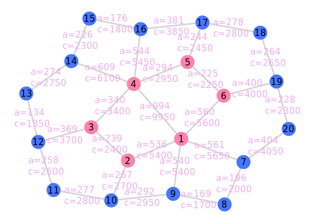.
_Rysunek 1. Model sieci oraz przepływy i przepustowości każdej z krawędzi dla macierzy z 2.2._

#### 3. Testy

##### 3.1 Niezawodność sieci

Miarą niezawodoności sieci jest prawdopodobieństwo tego, że w dowolnym przedziale czasowym, nierozspójona sieć zachowuje $T < T_{max}$, gdzie:

$T = \frac{1}{G} * Σ_{e}$ $\frac{a(e)}{(\frac{c(e)}{m} - a(e))}$

gdzie:

- $T_{max}$ to maksymalne opóźnienie pakietu
- $G$ jest sumą wszystkich elementów macierzy natężeń
- $Σ_{e}$ oznacza sumowanie po wszystkich krawędziach $e$ ze zbioru krawędzi $E$
- $m$ jest średnią wielkością pakietu w bitach

Za niezawodność sieci przyjmujemy wyliczoną w następujący sposób wartość (przy $n$ iteracji):

1. Rozpoczynając z początkową topologią, dla każdej krawędzi losujemy wartość z przedziału $(0, 1)$,a potem porównujemy ją z prawdopodobieństem nie zepsucia się krawędzi $p$. Jeżeli wylosowana wartość jest większa od $p$, to usuwamy krawędź z grafu.
2. Sprawdzamy, czy tak zmieniony graf jest nadal połączony, tj. żeby z dowolnego wierzchołka $v_i$ można było przejść do wierzchołka $v_j$, jeśli nie, to próba kończy się porażką.
3. Wyznaczamy na nowo wartość funkcji $a$ dla zmienionego grafu.
4. Jeżeli dla dowolnej krawędzi $a(e) \geq \frac{c(e)}{m}$, próba kończy się porażką, gdyż dana krawędź została przeciążona.
5. Następnie liczymy średnie opóźnienie pakietu $T$ i sprawdzamy, czy $T < T_{max}$. Jeśli to prawda, to próbę uznaje się za zaliczoną.
6. Za niezawodność sieci przyjmujemy średnią arytmetyczną sukcesów ze wszystkich iteracji.

##### 3.1.1 Przykładowe zmodyfikowane sieci
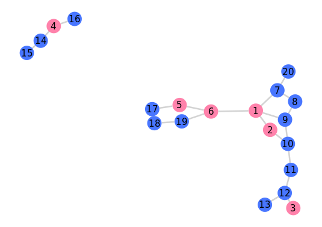.
_Rysunek 2. Sieć, dla której iteracja zakończyła się porażką ze względu na odizolowane wierzchołki._

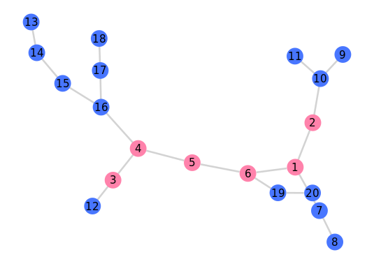.
_Rysunek 3._

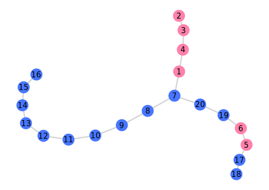.
_Rysunek 4._

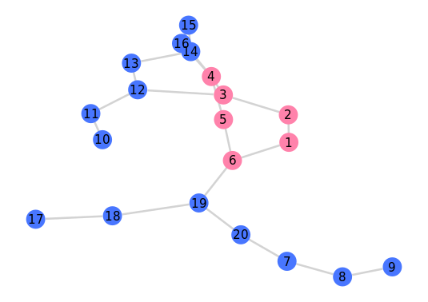.
_Rysunek 5._

Rysunki 3., 4., 5. przestawiają sieci, dla których iteracja zakończyła się sukcesem.

##### 3.2 Przeprowadzanie testów:
Dla określonych testów zmieniałam jedną z trzech wartości algorytmu sprawdzającego niezawodność sieci: wielkość pakietu w sieci, prawdopodobieństwo nieuszkodzenia krawędzi lub maksymalne opóźnienie.

W teście niezawodności liczba iteracji, to $100$.

Dla danego testu wykonałam $10$ powtórzeń przy $5$ różnych wartościach zmiennych ($+5$ powtórzeń dla każdej z nich), przy czym zmieniana wartość była zwiększana o $step$, odpowiednio różny dla każdego z parametrów. Łącznie dla każdego testu jest to $25000$ oszacowań niezawodności sieci.

##### 3.3 Obserwacje:
Po wykonaniu wszystkich testów można wywnioskować, że:

- niezawodność sieci maleje wraz ze wzrostem $m$
- niezawodność sieci rośnie wraz ze wzrostem $p$ lub $T_{max}$

##### 3.3.1 Zwiększanie liczby pakietów
Zwiększanie liczby pakietów wykonałam dla $10$ powtórzeń przy dodanych wartościach w macierzy natężeń w liczbie $[100, 200, ..., 1000]$. Za każdym razem zmieniana była losowa wartość z macierzy, przy czym była ona zwiększana o $step$ równy $10$.

##### Wykresy:
- zmiana $T_{max}$:
  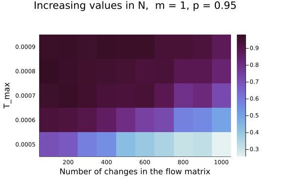.

- zmiana $p$:
  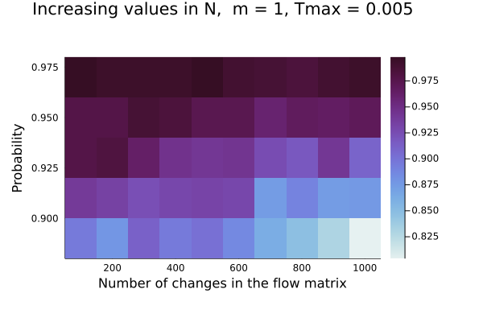.

- zmiana wielkości pakietu:
  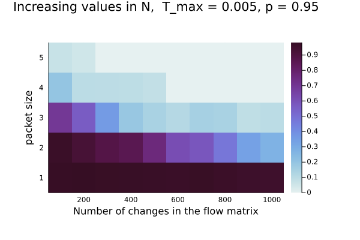.
  
  Większa liczba przesyłanych pakietów może częściej powodować "zator" w sieci, czyli sprawić, że liczba przesyłanych pakietów jest większa od przepustowości.

##### 3.3.2 Zwiększenie przepustowości krawędzi
Mając zadane przepustowości sieci, dla każdej krawędzi zwiększałam je o $i * 50$.
Zmienna $i$ była w tym wypadku liczbą iteracji od $1$ do $10$.

##### Wykresy:
- zmiana $T_{max}$:
  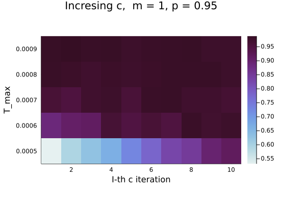.

- zmiana $p$:
  .

- zmiana wielkości pakietu:
  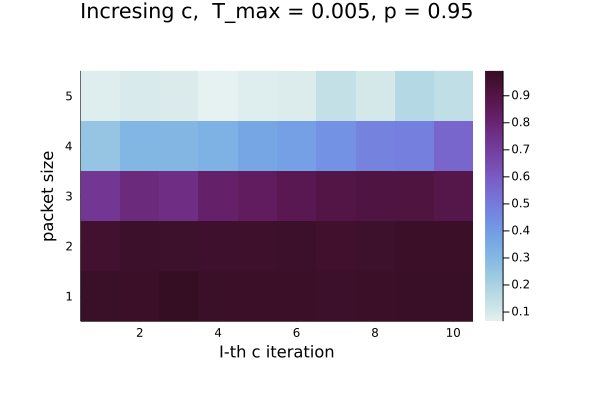.
  
  Większa przepustowość oznacza, że możemy przesłać więcej pakietów przez tę krawędź. Dzięki temu zwiększa się nasza niezawodność sieci.

##### 3.3.3 Dodawnie nowych krawędzi
Przy dodawaniu krawędzi wykonałam $i = 10$ iteracji, dla każdej z nich jako liczbę dodanych krawędzi używałam numer iteracji, która się aktualnie wykonywała.

##### Wykresy:
- zmiana $T_{max}$:
  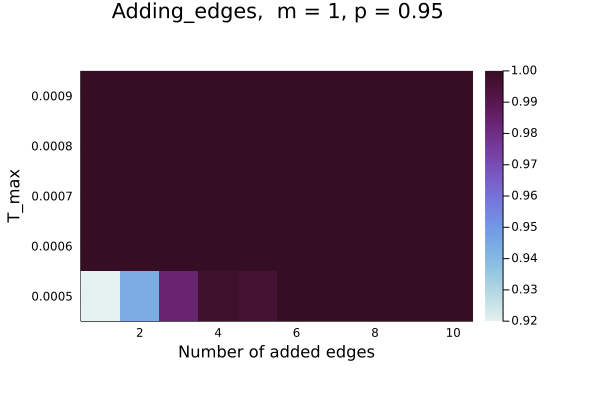.

- zmiana $p$:
  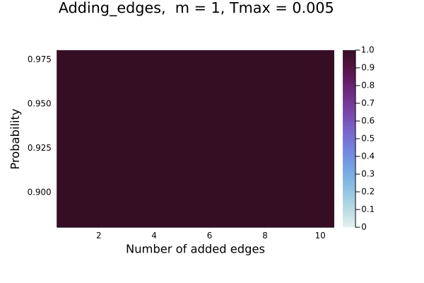.

- zmiana wielkości pakietu:
  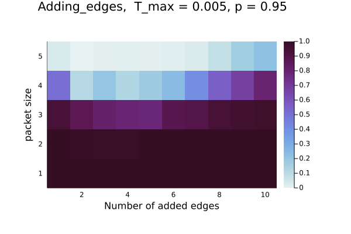.
  
  Dodawanie krawędzi pozytywnie wpływa na znajdowanie szybszych ścieżek między wierzchołkami, a zatem zwiększa się także niezawodność sieci.
