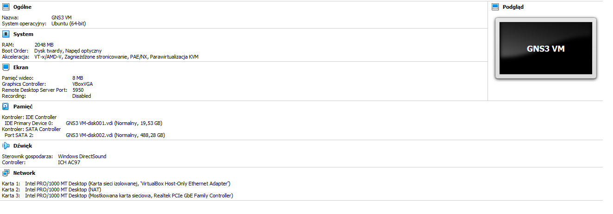
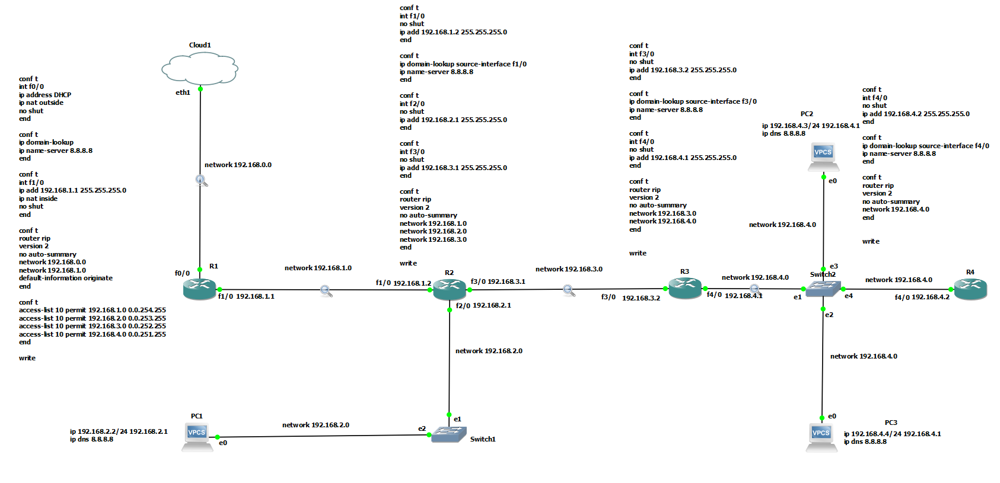
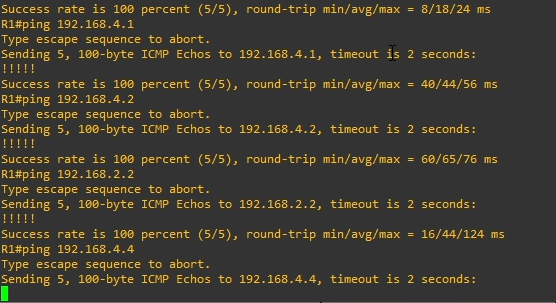
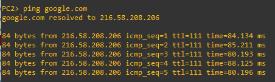
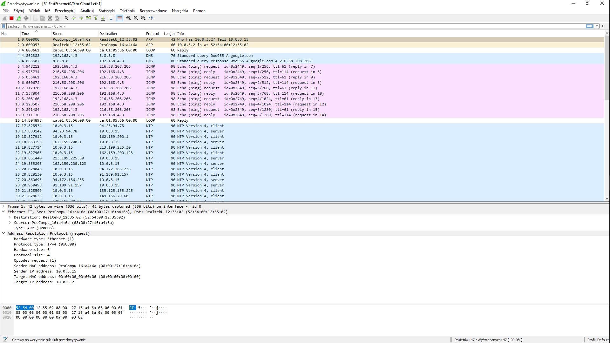
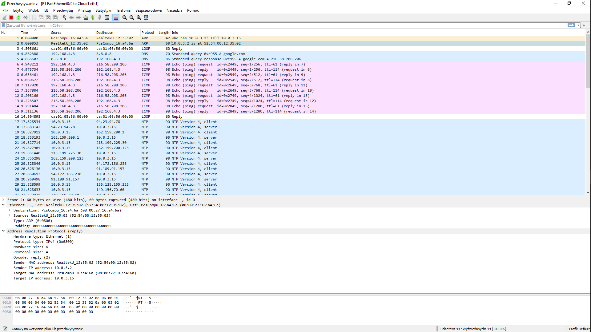
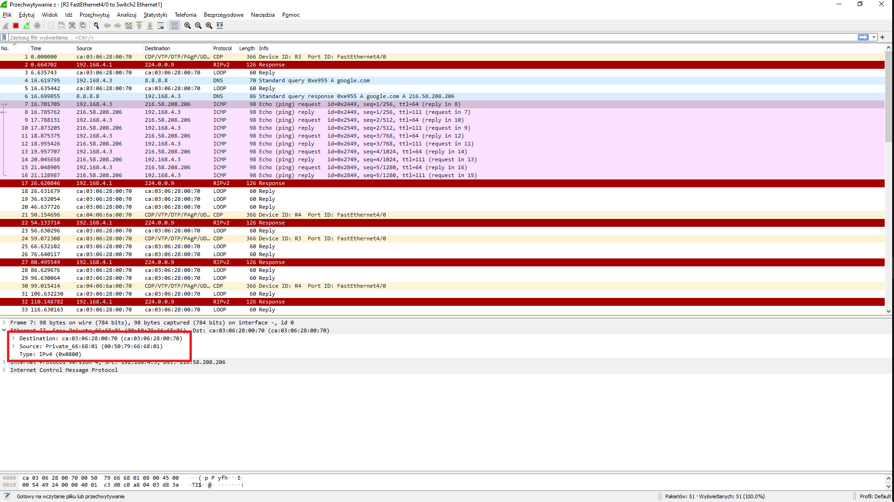
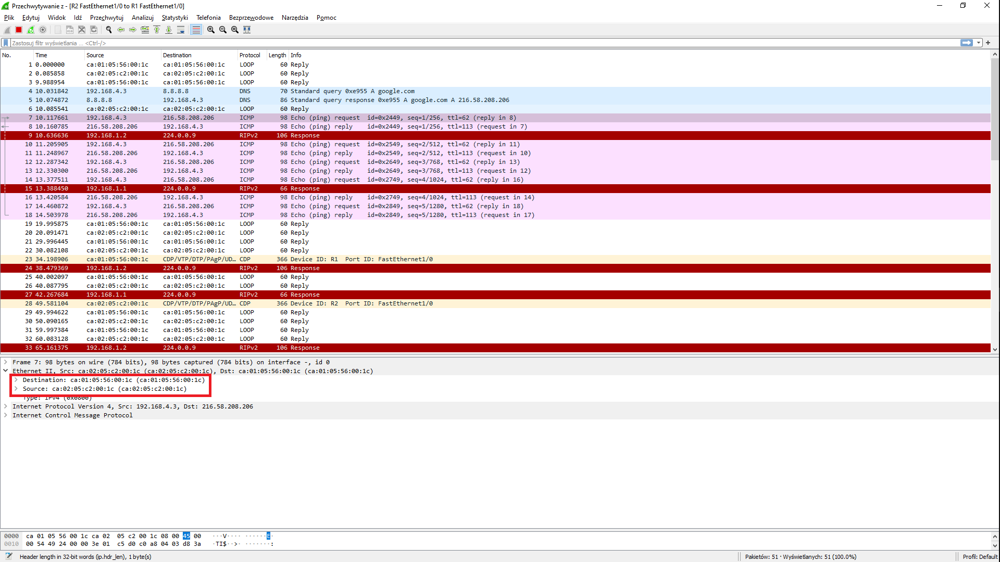
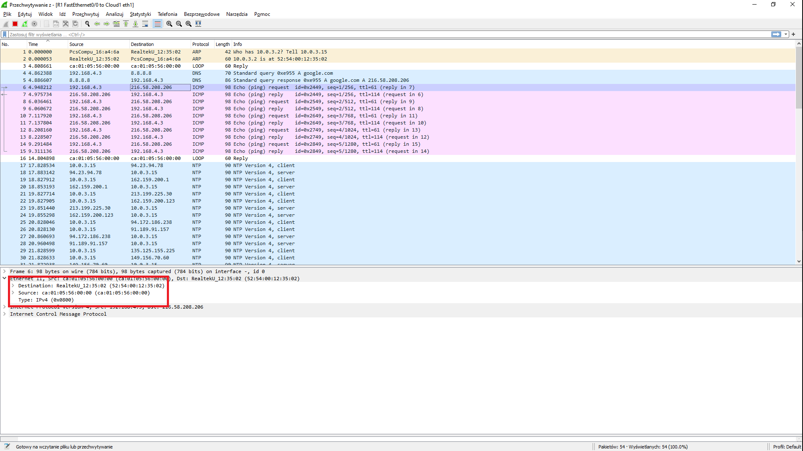

# Sprawozdanie Lista 4

| Przedmiot  | Technologie sieciowe   |
| ---------- | ---------------------- |
| Prowadzący | Mgr inż. Dominik Bojko |
| Autor      | Joanna Kulig           |
| Indeks     | 261743                 |
| Grupa      | Czw. 17:05 - 18:45     |
| Kod grupy  | K03-76d                |

#### 1. Opis zadania.

Celem zadania było skofigurowanie sieci wirtualnej o podanej topologii za pomocą symulatora GNS3. Przy jej realizacji, należało się upewnić, że:

- sieć jest podłączona do zewnętrznej, fizycznej sieci **Cloud**
- router bezpośrednio połączony z siecią **Cloud** uzyskuje z niej dynamiczny adres IP
- pozostałe urządzenia podsiadają dynamiczny adres IP w swoich sieciach
- możliwe jest wysyłanie komunikatów "ping" pomiędzy dowolną parą urządzeń oraz na adres zewnętrzny.

Następnie należało ustawić przechwytywanie pakietów na niektórych fragmentach sieci, a następnie je przeanalizować po wysłaniu zapytania "ping google.com" z jednego z urządzeń.

#### 1 Środowisko

GNS3 (ang. Graphical Network Simulator) to emulator sieci, dzięki któremu można tworzyć i testować konfiguracje sieci.
Można go pobrać za darmo z [oficjalnej strony](https://www.gns3.com/) GNS3.

##### 1.1. GNS3 VM

Przy instalowaniu programu należy również zainstalować [odpowiednie narzędzie](https://www.gns3.com/software/download-vm) do wirtualizacji. Należy go zaiomportować do programu z zakładce Prefercences -> GNS3 VM. Jest ono potrzebme, aby móc wirtualizować serwer oraz podpięte w symulacji urządzenia.

Specyfikacja maszyny wirtualnej w VirtualBox:


_Rysunek 1. Specyfikacje maszyny wirtualnej GNS3._

Wybrane dla maszyny karty sieciowe mają znaczenie. Oprócz kart "VBox host-only" oraz NAT trzeba także podpiąć mostkowaną kartę sieciową, która wskazuje na faktyczną kartę w komputerze. GNS3 stanowczo odradza używania do tego celu wifi, zatem została wykorzystana karta ethernetowa.
Dodatkowo ważne jest zaznaczenie opcji Nested VT-x/AMD-V, aby można było symulować maszyny wirtualne odpowiadające urządzeniom dodawanym do naszej topologii.

##### 1.2 Obraz routera

Do zrobienia konfiguracji wykorzystany został router Cisco 7200. Jego obraz jest dostępny do pobrania na [GNS3 Marketplace](https://www.gns3.com/marketplace/featured/cisco-7200). Należy go zaimportować do programu z zakładce Prefercences -> DSynamips -> IOS routers.

#### 2. Konfiguracja sieci


_Rysunek 2. Zadania konfiguracja sieci._

##### 2.1 Komendy do konfiguracji urządzeń.

Konfiguracja routerów:

```
sh ip int br                        // pozwala na podpatrzenie interfejsów danego urządzenia
conf t                              // wejście w tryb konfiguracji urządzenia
int X                               // przejście do konfiguracji interfejsu X
ip add X Y                          // ustawienie urządzeniu adres X oraz maskę Y
no shut                             // uruchamianie interfejsu

ip domain-lookup source-interface X // ustawienie wyszukiwania nazw serwerów przez interfejs X
ip name-server 8.8.8.8              // ustawienie adresu DNS

// RIP (ang. Routing Information Protocol) - służący do wyznaczania najlepszej trasy między źródłem, a celem
// skonfigurowanie routowania zgodnie z RIP w wersji 2
router rip
version 2
// konfiguracja RIP
default-information originate       // ustawienie domyślej ścieżki do sieci zewnętrznej
no auto-summary                     // wyłącza auto-sumowanie ścieżek

network X                           // informowanie routera o bezpośrednim dostępie do sieci X

end                                 // zakończenie konfiguracji
write                               // zapisanie danej konfiguracji
```

Konfiguracja komputerów:

```
ip X Y                              // nadanie komputerowi ip wraz z maską X oraz adresu ip routera Y, który łączy go z siecią
ip dns 8.8.8.8                      // nadanie adresu serwera DNS
sh ip all                           // pokazanie ip oraz gateway'a komputera
```

##### 2.2 Konfiguracja routera brzegowego:

Przy konfiguracji brzegowego routera R1 musimy go połączyć z **Cloud'em**, w celu uzyskaniu dostępu do internetu.

```
R1# conf t
R1(config)# int f0/0
R1(config-if)# ip address dhcp      // ustawienie adresu ip routerowi przez sieć zgodnie z protokołem dhcp
R1(config-if)# ip nat outside       // oznacznie intefejsu jako publiczny
R1(config-if)# no shut
R1(config-if)# end
```

Następnie ustawiamy adres DNS, aby można było pingować serwery po ich nazwach, zamiast po ich adresach ip.

```
R1# conf t
R1(config)# ip domain-lookup        // ustawienie wyszukiwania nazw serwerów
R1(config)# ip name-server 8.8.8.8
R1(config)# end
```

Przed konfiguracją innych routerów niż brzegowy, musimy mu przygotować interfejs, dzięki któremu będzie się mógł łączyć z wewnętrznymi urządzeniami.

```
R1# conf t
R1(config)# int f1/0
R1(config-if)# ip add 192.168.1.1 255.255.255.0
R1(config-if)# ip nat inside       // oznacznie intefejsu jako prywatny
R1(config-if)# no shut
R1(config-if)# end
```

Należy również skonfigurować routing oraz dostęp routera do odpowiednich sieci.

```
R1# conf t
R1(config)# router rip
R1(config-router)# version 2
R1(config-router)# no auto-summary
R1(config-router)# network 192.168.0.0
R1(config-router)# network 192.168.1.0
R1(config-router)# default-information originate.
R1(config-router)# end
```

Na końcu musimy ustawić routerowi R1 tzw. **access list**, czyli listę adresów, od których pakiety może przesyłać na zewnątrz. Podajemy adresy sieci, które chcemy przepuścić oraz odwróconą maskę.

```
R1# conf t
R1(config)# access-list 10 permit 192.168.1.0 0.0.0.255
R1(config)# access-list 10 permit 192.168.2.0 0.0.0.255
R1(config)# access-list 10 permit 192.168.3.0 0.0.0.255
R1(config)# access-list 10 permit 192.168.4.0 0.0.0.255
R1(config)# end
```

Zapisujemy konfigurację komendą **write**.

##### 2.3 Konfiguracja pozostałych routerów:

Routery inne niż brzegowy konfigurujemy w podobny sposób, pomijając jedynie kilka komend, które zostały użyte przy routerze R1. 
Nie ma sensu pokazywania konfiguracji każdego z nich, zatem pokażę ją na przykładzie routera R3.

```
R3# conf t
R3(config)# int f3/0
R3(config-if)# no shut
R3(config-if)# ip add 192.168.3.2 255.255.255.0
R3(config-if)# end

R3# conf t
R3(config)# ip domain-lookup source-interface f3/0
R3(config)# ip name-server 8.8.8.8
R3(config)# end

R3# conf t
R3(config)# int f4/0
R3(config-if)# no shut
R3(config-if)# ip add 192.168.4.1 255.255.255.0
R3(config-if)# end

R3# conf t
R3(config)# router rip
R3(config-router)# version 2
R3(config-router)# no auto-summary
R3(config-router)# network 192.168.3.0
R3(config-router)# network 192.168.4.0
R3(config-router)# end

R3# write
```

##### 2.4 Konfiguracja switcha:

Urządzenia switch nie wymagają konfiguracji po ich odpowiednim podpięciu.

##### 2.5 Konfiguracja komputera:

Konfiguracja na podstawie komputera PC1.

```
PC2> ip 192.168.4.3/24 192.168.4.1
PC2> ip dns 8.8.8.8
```

Sprawdzenie poprawności działania polecenia **ping** na inne urządzenia w sieci.


_Rysunek 3. Polecenie ping na inne adresy w sieci wykonane z urządzenia R1_

Sprawdzenie poprawności działania polecenia **ping** na serwery zewnętrzne z urządzenia PC2.


_Rysunek 4. Polecenie 'ping google.com' wykonane z urządzenia PC2_

#### Przechwytywanie i analiza pakietów:

Nasłuchiwanie pakietów należało ustawić na sieciach 192.168.0.0, 192.168.1.0 oraz 192.168.4.0. Jest to zaznaczone na Rysunku 1. za pomocą lupki na danych fragmentach konfiguracji.

Do przechwytywania i podglądania pakietów został użyty program [wireshark](https://www.wireshark.org/). 

Analizę pakietów przeprowadzimy w wyniku wydania polecenia `ping google.com` z urządzenia PC2. 

Na początku komputer szuka urządzenia, które zostało mu przydzielone jako gateway, w tym celu wysyła zapytanie zgodnie z protokołem ARP. Odpowiada mu router R3 poprzez wysłanie mu swojego adresu MAC.


_Rysunek 5. Zapytanie ARP, who has 10.0.3.2? Tell 10.0.3.15._


_Rysunek 6. Odpowiedź ARP, 10.0.3.2 is ar 52:54:00:12:35:02._

Adres ten jest potem użyty, aby wysłać zapytanie DNS, które pozwoli nam rozpoznać adres **google.com**.


_Rysunek 7. Zapytanie DNS._


_Rysunek 8. Odpowiedź DNS._

Po uzyskaniu odpowiedzi z adresem serwera, komputer PC2 zaczyna na niego wysyłać pakiety.


_Rysunek 9. Przesyłane pakiety między R3 a switchem._


_Rysunek 10. Przesyłane pakiety między R1 a R2._


_Rysunek 11. Przesyłane pakiety między Cloudem a R1._

Na czerwono można zobaczyć jak zmienia się destination i source każdego pakietu ICMP dla danej podsieci. Zaczynając przesyłanie pakietów, PC2 musi je wszystkie przesłać przez router R3. W nim ramki są przepakowywane na nowy destination i source. Nowym sourcem zostaje R3, a destination to następny router na drodze do Clouda. Na ostatnim odcinku (między R1 a Cloudem) można zauważyć, że destination to RealtekU, czyli karta sieciowa ethernet. Potem pakiety idą do danego adresu serwera.
