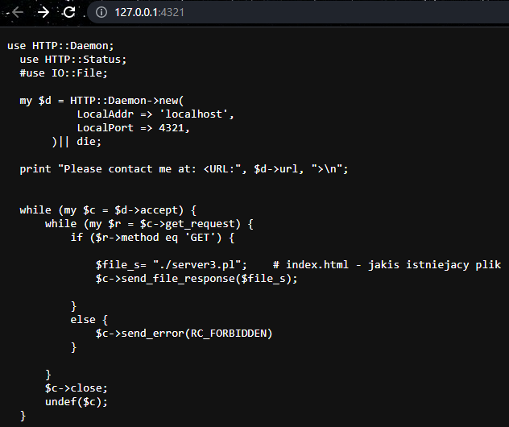
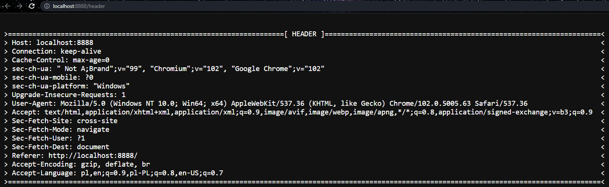
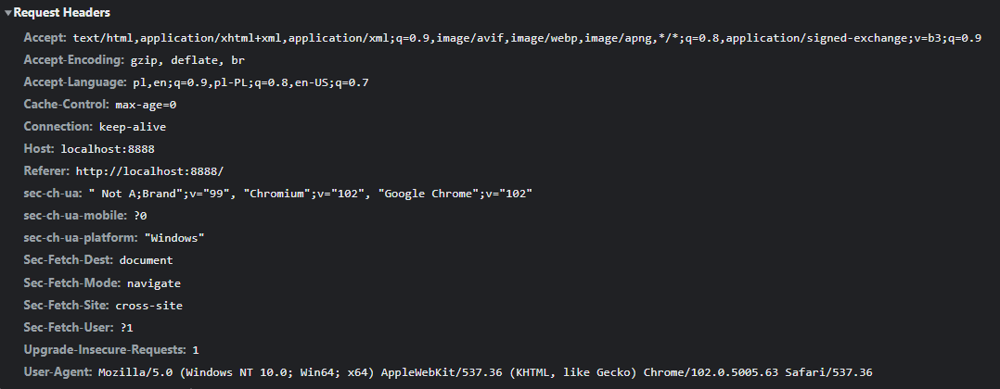
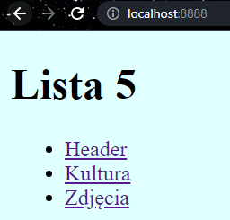
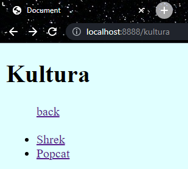
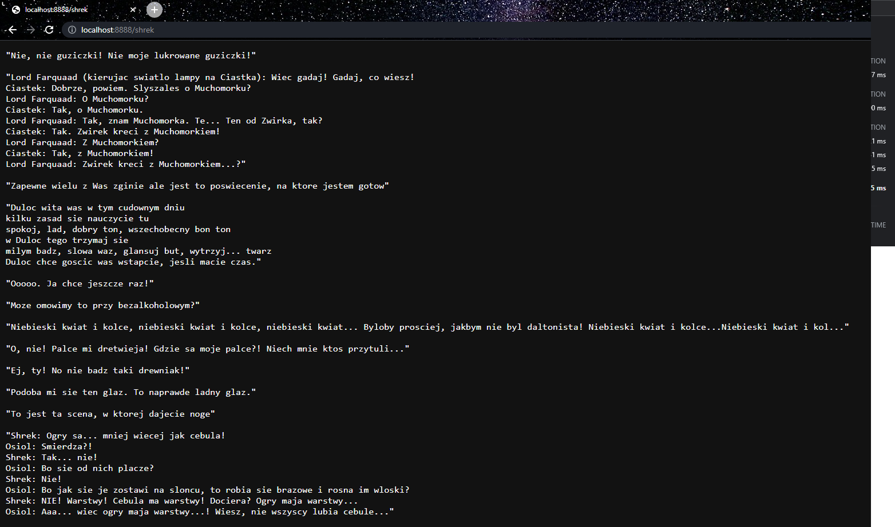
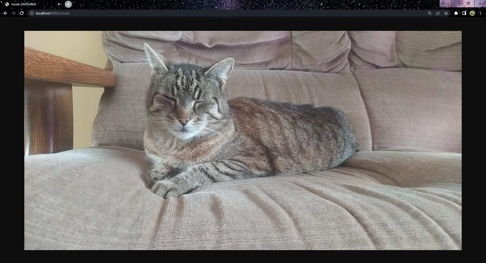
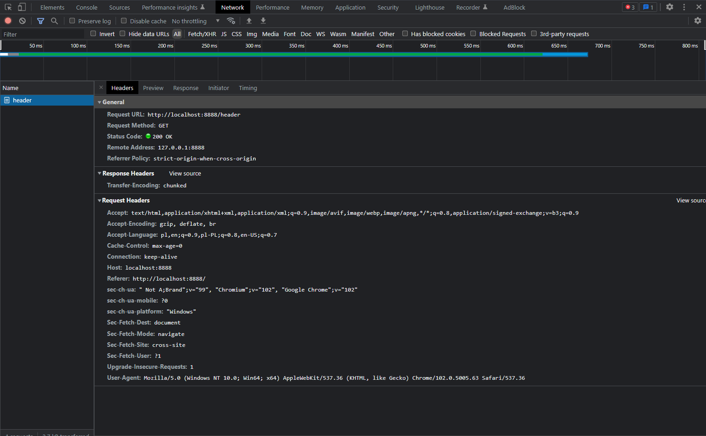
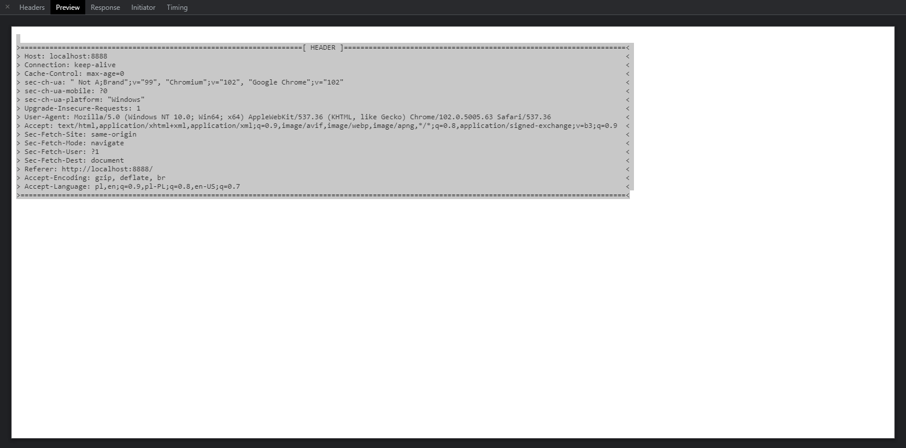
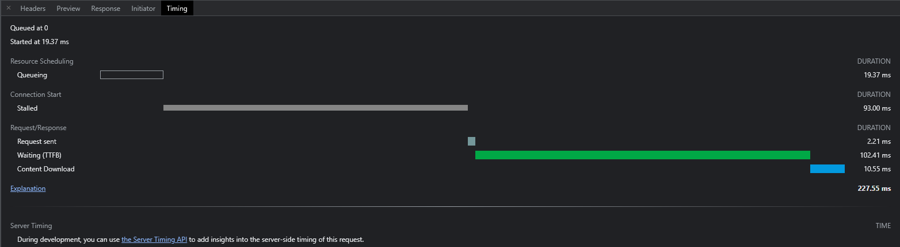

# Sprawozdanie Lista 5

| Przedmiot  | Technologie sieciowe   |
| ---------- | ---------------------- |
| Prowadzący | Mgr inż. Dominik Bojko |
| Autor      | Joanna Kulig           |
| Indeks     | 261743                 |
| Grupa      | Czw. 17:05 - 18:45     |
| Kod grupy  | K03-76d                |

#### 1. Opis zadania.

Na podstawie [załączonego skryptu](https://cs.pwr.edu.pl/bojko/2122_2lato/server3.pl) należało:

- przeanalizować działanie serwera
- nawiązać połączenie za pomocą przeglądarki internetowej

Ponadto, zmieniając powyższy skrypt lub pisząc własny należało:

- zaimplementować zwracanie klientowi nagłówek jego żądania
- zaimplementować obsługę żądań klienta do prostego tekstowego serwisu WWW, który składałby się z kilku statycznych stron z wzajemnymi odwołaniami
- przeanalizować komunikaty wysyłane do i od serwera

##### 1.1 Środowisko.

Zamiast korzystać z podanego skryptu, napisałam własną implementację, używając do tego języka Julia oraz prostego HTML.

#### 2. Analiza skryptu.

```perl
use HTTP::Daemon;
use HTTP::Status;
#use IO::File;

my $d = HTTP::Daemon->new(
          LocalAddr => 'lukim',
          LocalPort => 4321,
      )|| die;

print "Please contact me at: <URL:", $d->url, ">\n";


while (my $c = $d->accept) {
  while (my $r = $c->get_request) {
    if ($r->method eq 'GET') {

      $file_s= "./index.html";    # index.html - jakis istniejacy plik
      $c->send_file_response($file_s);

    }
    else {
      $c->send_error(RC_FORBIDDEN)
    }

    }
  $c->close;
  undef($c);
}
```

Powyższy skrypt, po włączeniu, uruchamia serwer daeomon na adresie `lukim` i porcie `4321`. Jednakże przy uruchomieniu musiałam zmienić adres serwera na `localhost`, aby serwer poprawnie działał.

Uruchomienie:

```sh
perl server3.pl

# Wiadomość po uruchomieniu:
Please contact me at: <URL:http://127.0.0.1:4321/>
```

Pierwsza pętla while obsługuje działanie serwera, mianowicie jeżeli serwer działa, będzie on wykonywał żądania klienta. Serwer zostaje zamkniętym, gdy nie obsługuje już żądań klienta.

Druga pętla obsługuje żądania klienta. Jeżeli jest ono typu **GET**, zwraca statyczny plik `index.html`. W przeciwnym przypadku wysyłany jest error **403 Forbidden**.


_Rysunek 1. Uruchomienie oraz zmiana programu server3.pl, aby pokazywał swój kod źródłowy._

#### 2. Implementacja serwera.

```julia
using HTTP, Sockets

const ROUTER = HTTP.Router()

HTTP.@register(ROUTER, "GET", "/header", req->HTTP.Response(200, "\n$(print(HTTP.Messages.headers(req)))"))

HTTP.@register(ROUTER, "GET", "/", req->HTTP.Response(read("./main.html")))
HTTP.@register(ROUTER, "GET", "/back", req->HTTP.Response(read("./main.html")))

HTTP.@register(ROUTER, "GET", "/kultura", req->HTTP.Response(read("./kultura.html")))
HTTP.@register(ROUTER, "GET", "/shrek", req->HTTP.Response(read("./shrek.txt")))
HTTP.@register(ROUTER, "GET", "/popcat", req->HTTP.Response(read("./popcat.gif")))

HTTP.@register(ROUTER, "GET", "/zdjecia", req->HTTP.Response(read("./zdjecia.html")))
HTTP.@register(ROUTER, "GET", "/misiek", req->HTTP.Response(read("./misiek.jpg")))
HTTP.@register(ROUTER, "GET", "/gloryhammer", req->HTTP.Response(read("./gloryhammer.png")))

HTTP.@register(ROUTER, "GET", "/*", req->HTTP.Response(404, "Not found!"))

HTTP.serve(ROUTER, Sockets.localhost, 8888)
```

Na początku impelmentacji serwera tworzony jest `ROUTER`, który będzie obsługiwał i pezekierowywał żądania od klienta. Każde z nich musi być zarejestrowane przez funkcję `HTTP.@register`, która zapisuje obsługę danego żądania.

Serwer uruchamiamy poprzez `HTTP.serve`, który zwróci serwer z routerem `ROUTER`, na adresie `localhost` z portem `8888`.

##### 2.1 Zwracanie nagłówka.

Aby zwrócić nagłówek należało użyć funkcji `HTTP.Messages.headers()`. Po napisaniu funkcji do printowania, otrzymałam następujący nagłówek:


_Rysunek 2. Nagłówek zwrócony przez serwer._

Po otworzeniu analizatora sieciowego możemy sprawdzić, że zgadza się z tym wysłanym od serwera.


_Rysunek 3. Nagłówek w analizatorze sieciowym._

##### 2.2 Serwis WWW.

Zaprojektowałam prosty serwis w HTML, który posiada dwie podstrony, z których można się cofać do strony głównej lub przechodzić do danych plików zlokalizowanych na moim dysku. Jest również opcja, aby zobaczyć wyżej opisany header żądania.


_Rysunek 4. Uruchomienie powyższego serwera._


_Rysunek 5. Podstrona /kultura z możliwoscią powrotu do strony głównej._


_Rysunek 6. Plik tekstowy Shrek._


_Rysunek 7. Gif Popcat._


_Rysunek 8. Zdjęcie kota._

#### 3. Analizator sieciowy.


_Rysunek 9. Analizator sieciowy._

##### 3.1 Analiza nagłówka.

```scala
Accept  // informuje jakie typy danych możemy wysłać w odpowiedzi

Accept-Encoding // Opisuje jakie typy kodowania możemy używać przy realizowaniu żądań

Accept-Language // Informuje jaki język jest używany

Cache-Control // Opisuje dyrektywy mechanizmu cache przy żądaniach i odpowiedziach

Connection // Kontroluje czy połączenie zostaje otwarte po zakończeniu żądania, keep-alive zapewnia, że będzie ono trałe

Host // Pokazuje adres i port serwera odbierającego żądania

Referer // Adres stront, z której wysłano żądanie do serwera

sec-ch-ua // Posiada informacje o przeglądarce i wersjach jego komponentów

sec-ch-ua-mobile  // Informacja o tym, czy użytkownik jest na urządzeniu mobilnym: 0? - nie jest, 1? - jest)

sec-ch-ua-platform // Pokazuje system wykorzystywany przez użytkownika.

Sec-Fetch-Dest // Pokazuje cel rządania

Sec-Fetch-Mode // Pokazuje tryb żadania

Sec-Fetch-Site // Pokazuje relację między źródłem żadania a celem żadania, same-site - żadanie przyszło z tej samej domeny, cross-site - z innej

Sec-Fetch-User // Pokazuje czy żądanie przyszło od użytkownika: 0? nie, 1? tak

Upgrade-Insecure-Requests // Wysyła sygnał do serwera, który przekauje preferencje użytkownika dot. szyfrowania i uwierzytelnania odpowiedzi

User-Agent // Pozwala zidentyfikować typ apikacji, system operacyjny oraz przeglądarkę i jej wersję
```

##### 3.2 Analiza pozostałych danych.

Oprócz informacji o nagłówku żądania, są tu także inne informacje:

```scala
Request URL // Pokazuje na jaki adres przyszło żądanie

Request Method // Pokazuje metodę żądania

Status Code // Pokazuje kod statusu odpowiedzi

Remote Address // Pokazuje adres serwera

Referrer Policy // Zakres informacji, które powinny być zawarte w żądaniu

// Response Header
Transfer Encoding // Określa formę szyfrowania, która została użyta do przesłania zasobu do użytkownika
```

W zakładce `Preview` można zobaczyć podgląd wysłanej użytkownikowi odpowiedzi, a w `Response` odpowiedź serwera.


_Rysunek 10. Preview._

W zakładce `Time` można się przyjrzeć czasom działania poszczególnych zadań.


_Rysunek 11. Time._
